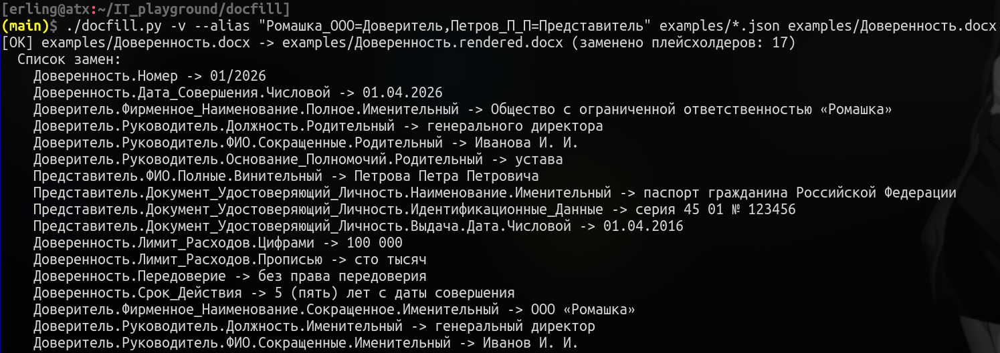
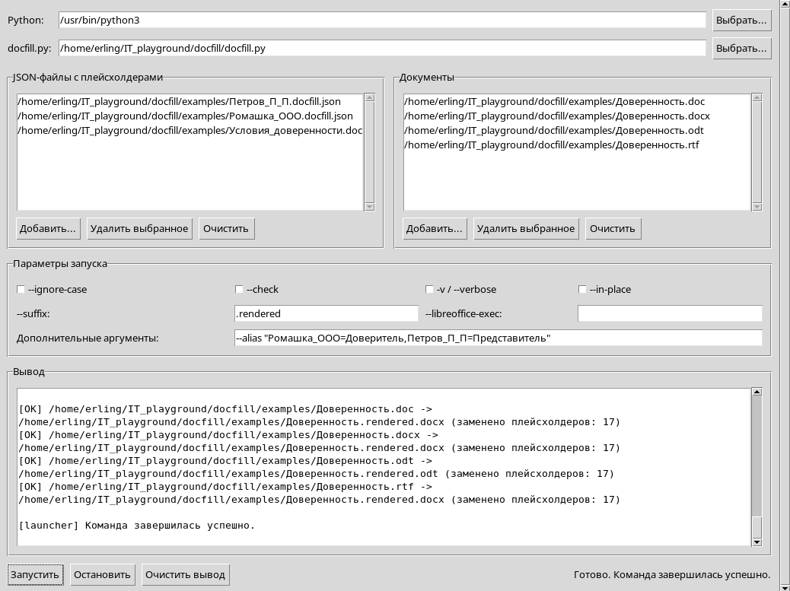

# Описание

**docfill** — программа для быстрого заполнения шаблонов документов, написанная на языке **Python**. Подставляет значения из JSON-файлов в файлы (документы) в форматах **DOCX (.docx)**, **ODT (.odt)**, **DOC (.doc)** и **RTF (.rtf)**.

## Принцип работы

docfill ищет в документах **плейсхолдеры** — подлежащие замене фрагменты текста типа `Доверитель.Руководитель.ФИО.Полные.Именительный` — и заменяет их на соответствующие значения из JSON-файлов.

## Интерфейс

docfill первоначально создана как консольная утилита (программа для интерфейса командной строки), однако имеет опциональную надстройку в виде графического интерфейса на базе .





## Сфера применения

docfill может пригодиться, если вам нужно многократно заполнять шаблоны документов, применяя одну и ту же логику подстановки данных, и вы хотите избежать ручного копирования и вставки. Например, она хорошо подходит для:
- договоров и различных приложений к ним;
- доверенностей;
- первичных учётных документов;
- кадровых документов;
- протоколов собраний;
- писем и других письменных сообщений.

### Почему просто не использовать нейросеть?

Потому что не обязательно забивать гвозди пневмомолотом. К тому же docfill:
- выполняется **локально** — без чат-ботов, локальных агентов с облачным бэкендом и прочих сетевых сервисов, то есть без передачи данных третьим лицам;
- демонстрирует более детерминированное (предсказуемое) поведение, чем многие современные нейросети (актуально по состоянию на дату последнего обновления программы).

## Реализация и портируемость

docfill — легко портируемая утилита. Если в вашей операционной системе установлен интерпретатор/компилятор Python, значит, вы можете использовать docfill. Это относится как к **Windows**, так и к **Unix-подобным операционным системам** (**MacOS**, **GNU/Linux**, семейству **BSD**).

Типичные способы запуска:
- в оболчках Windows — **cmd** или **PowerShell**;
- в оболочках Unix-подобных операционных систем, таких как **sh**, **bash**, **zsh** и им подобных;
- в графическом интерфейсе, являющемся надстройкой над docfill как консольной утилитой.

## Поддерживаемые форматы

**DOCX** и **ODT** поддерживаются напрямую. **DOC** и **RTF** обрабатываются после предварительной конвертации в **DOCX** с помощью .

JSON-файлы распознаются программой **по расширению `.json`**. Таким образом, наличие в именах JSON-файлов соответствующего расширения является обязательным для корректной работы программы. Примеры допустимых имён JSON-файлов:
- `Ромашка_ООО.json`;
- `Ромашка_ООО.docfill.json`;
- `Организация.json`;
- `Доверитель.json`;
- `company.json`;
- `bank.json`;
- `Условия.json`;
- `term_sheet.json`.

## Шаги использования

1. Пользователь указывает программе, во-первых, один или несколько JSON-файлов с подставляемыми данными, и во-вторых, один или несколько документов, в которые нужно подставить данные (целевых файлов).
2. Пользователь запускает программу.
3. Программа находит в целевых файлах плейсхолдеры и готовится заменить их значениями из JSON-файлов.
4. Если при запуске программы использована опция `--in-place`, то программа подставляет данные непосредственно в целевые файлы. Если эта опция опущена, то программа создаёт копии целевых файлов и подставляет данные в них. В случае с целевыми файлами в форматах `DOC` и `RTF` опция `--in-place` недоступна: подстановка может быть выполнена только в создаваемых копиях в формате `DOCX`.

## Формат плейсхолдеров

Плейсхолдеры представляют собой иерархические поля (ключи), собранные из JSON через точку. Например, если JSON-файл содержит:

```json
{
  "Ромашка_ООО": {
    "ИНН": "7801323609",
    "Руководитель": {
      "ФИО": {
        "Полные": {
          "Именительный": "Иванов Иван Иванович",
          "Родительный": "Иванова Ивана Ивановича"
        },
        "Краткие": {
          "Именительный": "Иванов И. И.",
          "Родительный": "Иванова И. И."
        }
      }
    }
  }
}
```

то в целевом файле программа по умолчанию будет работать со следующими плейсхолдерами:
- `Ромашка_ООО.ИНН`
- `Ромашка_ООО.Руководитель.ФИО.Полные.Именительный`
- `Ромашка_ООО.Руководитель.ФИО.Полные.Родительный`
- `Ромашка_ООО.Руководитель.ФИО.Краткие.Именительный`
- `Ромашка_ООО.Руководитель.ФИО.Краткие.Родительный`

**Важно**: при запуске программы можно настроить соответствия между теми или иными полями. Например, если у вас есть JSON-файл с реквизитами ООО "Ромашка", в котором старшим в иерархии полем является `Ромашка_ООО`, и вам нужно подставить данные этой организации в шаблон документа, в котором данные соответствующего лица заменены плейсхолдерами типа `Доверитель.Руководитель.ФИО.Полные.Именительный`, то вам нужно подсказать программе, что `Ромашка_ООО` — это и есть `Доверитель`. Для этого используется опция `--alias` (например, `--alias "Ромашка_ООО=Доверитель"`).

docfill может принимать на вход несколько JSON-файлов одновременно. Это удобно, если данные разложены по смысловым частям, например:
- данные об одном лице — в одном файле;
- данные о другом лице — в другом;
- условия сделки — в третьем.

Если один и тот же плейсхолдер встречается в нескольких JSON-файлах:
- с одинаковым значением — это допустимо;
- с разными значениями — программа завершится с ошибкой.

## Зависимости

### Python

Требуется Python 3.

### Для DOCX и ODT

Дополнительные внешние программы не требуются.

### Для DOC и RTF

Для обработки файлов `.doc` и `.rtf` нужен LibreOffice, потому что эти форматы сначала конвертируются в DOCX.

Если `docfill` не может сам найти исполняемый файл LibreOffice, можно указать его явно с помощью опции `--libreoffice-exec`.

### tkinter

Для использования надстроечного графического интерфейса требуется пакет tkinter.

## Запуск

### Windows
```
python docfill.py --alias "Ромашка_ООО=Доверитель,Петров_П_П=Представитель" Ромашка_ООО.docfill.json Петров_П_П.docfill.json Условия_доверенности.docfill.json Доверенность.docx
```

### Unix-подобные системы
```bash
python docfill.py --alias "Ромашка_ООО=Доверитель,Петров_П_П=Представитель" Ромашка_ООО.docfill.json Петров_П_П.docfill.json Условия_доверенности.docfill.json Доверенность.docx
```

Или, если местоположение исполняемого файла docfill добавлено в переменную PATH:
```bash
docfill.py --alias "Ромашка_ООО=Доверитель,Петров_П_П=Представитель" Ромашка_ООО.docfill.json Петров_П_П.docfill.json Условия_доверенности.docfill.json Доверенность.docx
```

## Вызов справки

Запустите программу с опцией `-h` или `--help`.

## Опции

- `-h`, `--help`  
  Показать краткую справку по использованию программы.

- `--ignore-case`  
  Искать плейсхолдеры без учёта регистра.

- `--check`  
  Проверить документы без подстановки данных в целевых файлах. Полезно для диагностики и просмотра найденных плейсхолдеров.

- `-v`, `--verbose`  
  Показать подробный список замен в формате **"было -> стало"**.

- `--in-place`  
  Подставлять данные (заменять плейсхолдеры) прямо в целевом файле, без создания копий. Недоступно для целевых файлов в форматах `DOC` и `RTF`.

- `--suffix SUFFIX`  
  Указать суффикс для имён создаваемых копий целевых файлов, добавляемый к именам исходных целевых файлов (перед расширением). По умолчанию используется суффикс `.rendered`.

- `--alias SOURCE=TARGET[,SOURCE=TARGET ...]`
  Установить соответствие между полями JSON. Например, опция `--alias "Ромашка_ООО=Доверитель"` позволит использовать в шаблоне плейсхолдеры `Доверитель.*` как альтернативу `Ромашка_ООО.*`. В графическом интерфейсе данная опция используется с помощью поля "Дополнительные аргументы".

- `--libreoffice-exec PATH`
  Указать путь к исполняемому файлу LibreOffice или (если имя такого файла глобально доступно из используемой оболочки операционной системы) его имя. Эта опция нужна **только для файлов в форматах `DOC` и `RTF`** и **только если программе не удалось самостоятельно найти исполняемый файл LibreOffice**.

## Вывод программы

По умолчанию при успешной обработке docfill показывает количество заменённых плейсхолдеров. При использовании опций `-v` или `--verbose` программа дополнительно выводит полный список произведённых подстановок.

## Особенности и ограничения

- При подстановке данных обычно применяется форматирование, заданное для первого фрагмента (первого слова, первого символа) исходного плейсхолдера.
- При использовании опции `--ignore-case` нельзя использовать JSON-файлы, в которых присутствуют разные поля (ключи), имена которых совпадают после приведения регистра. Например, поля `Ромашка` и `РОМАШКА` будут конфликтовать.
